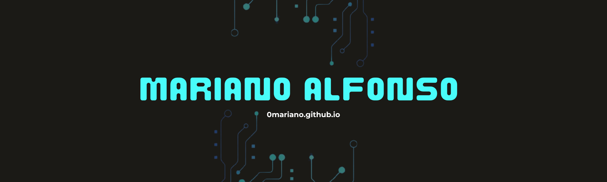

  
  <h1 align="center">Hi, I'm Mariano 👋🏼</h1>

 

## <picture></picture> **Whoami**

 

- 👨‍💻 Apasionado por la Ciberseguridad
- 📚 CyberSecurity Student - Actualmente **cursando segundo año** de la carrera Tec. Universitaria en Ciberseguridad 
- 🚩 CTFs Player - Escribo Write - Ups en mi <a href="https://0mariano.github.io">**Blog**</a>

 

  

 
